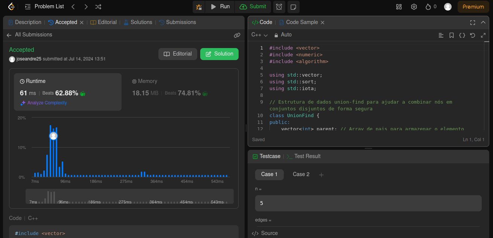

# Questões - Juíz Online

**Número da Lista**: X<br>
**Conteúdo da Disciplina**: Grafos 2<br>

## Alunos

| Matrícula  | Aluno                               |
| ---------- | ----------------------------------- |
| 21/1062016 | José André Rabelo Rocha |
| 20/0020323 | Jefferson Sena Oliveira         |

## Apresentação
A apresentação pode ser vista no YouTube por meio do link: 

## Sobre

Este projeto consiste na realização de exercícios de plataformas de juízes eletrônicos. Serão desenvolvidos problemas de média e alta
complexidade com ênfase nos conteúdos vistos no módulo de grafos 2. 

## Screenshots

#### Exercício 01 - Find Critical and Pseudo-Critical Edges in Minimum Spanning Tree

Dificuldade: Dífícil <br>
Descrição do Problema: [1489. Find Critical and Pseudo-Critical Edges in Minimum Spanning Tree
](https://leetcode.com/problems/find-critical-and-pseudo-critical-edges-in-minimum-spanning-tree/description/)<br>
Solução Proposta: [Código de Solução](https://github.com/projeto-de-algoritmos-2024/Grafos2_QuestoesJuizOnline/blob/master/Find_Critical_and_Pseudo_Critical_Edges_in_Minimum_Spanning_Tree/find_minimum_spanning.cpp)



#### Exercício 02 - Min Cost to Connect All Points

Dificuldade: Média <br>
Descrição do Problema: [1584. Min Cost to Connect All Points](https://leetcode.com/problems/min-cost-to-connect-all-points/description/)<br>
Solução Proposta: [Código de Solução]() 


#### Exercício 03 - X

Dificuldade: X <br>
Descrição do Problema: [X](Y)<br>
Solução Proposta: [Código de Solução]() 


#### Exercício 04 - X

Dificuldade: X <br>
Descrição do Problema: [X](Y)<br>
Solução Proposta: [Código de Solução]() 


## Instalação

**Linguagem**: C, C++<br>
<!-- **Framework**: (caso exista)<br> -->
Descreva os pré-requisitos para rodar o seu projeto e os comandos necessários.

## Uso

Instruções para compilar e executar o código C++:

1. Certifique-se de ter um compilador para C, C++ instalado em sua máquina. Recomendamos o gcc.

2. Faça o clone do repositório Git para o seu ambiente local.

3. No terminal, navegue até o diretório onde está localizado o arquivo de código-fonte (.cpp ou .c) que deseja compilar.

4. - Compile o arquivo de código-fonte utilizando o seguinte comando:
```g++ -o <nome-do-executavel> <nome-do-arquivo.cpp>```
Substitua <nome-do-executavel> pelo nome desejado para o executável e <nome-do-arquivo.cpp> pelo nome do arquivo de código-fonte.
    - Para a execução em C: Compile o arquivo de código-fonte utilizando o seguinte comando:
```gcc <nome-do-arquivo.cpp> -o <nome-do-executavel> ```
Substitua <nome-do-executavel> pelo nome desejado para o executável e <nome-do-arquivo.cpp> pelo nome do arquivo de código-fonte.

5. Após a compilação bem-sucedida, execute o programa com o seguinte comando:
```./<nome-do-executavel>```
Certifique-se de estar no diretório correto em seu terminal para executar o programa.

6. Opcional: Deixamos arquivos de entrada para casos de teste (por exemplo, in.txt). Assim, você pode redirecionar a entrada para o programa durante a execução. Por exemplo:
```./<nome-do-executavel> < <nome-do-arquivo-de-input>.txt```

<!--## Outros

Quaisquer outras informações sobre seu projeto podem ser descritas abaixo.

-->
